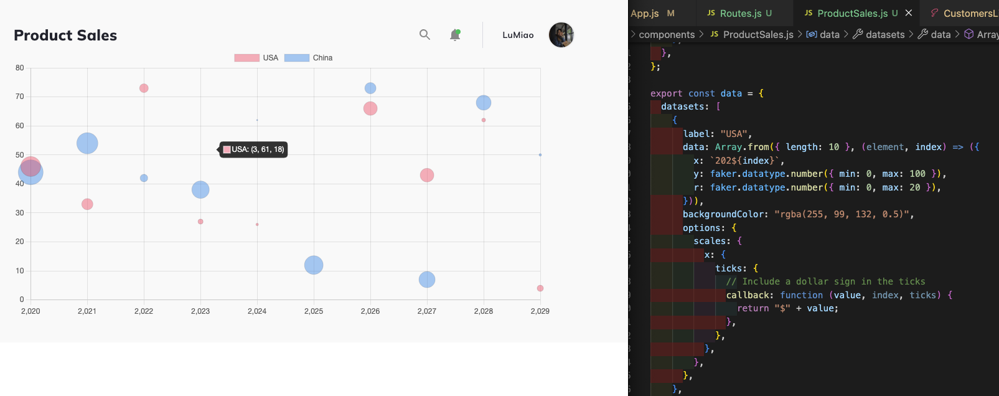

# MeowMeow-CatStore

MeowMeow is a cat ecommerce admin platform. It is built entirely with React, and utilizes `react-chartjs-2`, which is a package of react components for Chart.js. The data used is currently static, though it can easily be refactored to handle dynamic data.

It was based off of the CodeFocus Channel's MeStore [code](https://github.com/CodeFocusChannel/mestore-chartjs).

### Design

Line Chart, Doughnut Chart, Bar Chart, Polar Area Chart

### Things that didn't go well

The bubble chart that I was planning to use, was not the right chart for the type of the data I wanted to show. Originally, I want to show the year as X-axis, but the bubble chart only takes number, not string.

### Would you recommend the library/framework/tool you used? Why?

I would recommend Charts.js, and Material UI for front-end web development.

### Possible future features / extensions

1. Make sure night mode will work for each page, and each chart
2. Add setting feature
3. Link all of dummy data to an API call

## Development

### `npm start`

Runs the app in the development mode.\
Open [http://localhost:3000](http://localhost:3000) to view it in the browser.

The page will reload if you make edits.\
You will also see any lint errors in the console.
